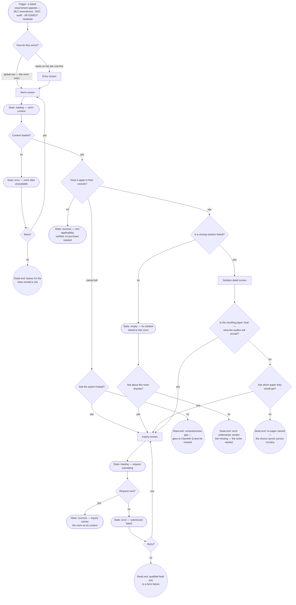
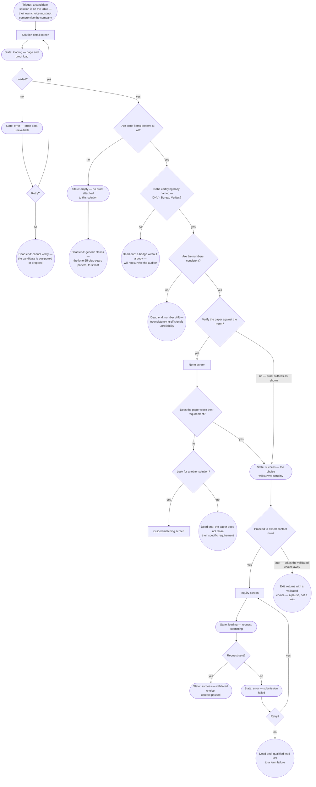
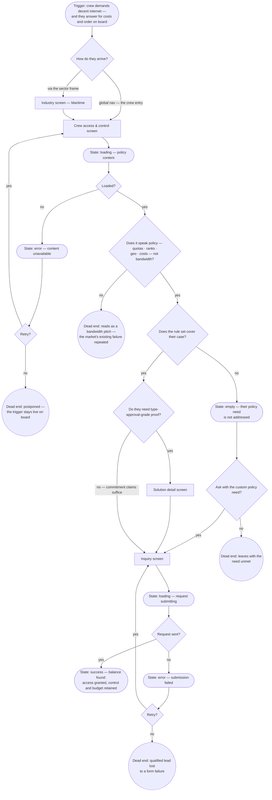

# User Flows — Asterra Networks

**Compiled:** 2026-08-05 · **Revised:** 2026-08-05 (adversarial critique pass — see
Quality check, second pass)
**Sources:** [`sitemap.md`](./sitemap.md) (§1 Entities, §5 Screens, §6 Navigation) ·
[`research/jtbd.md`](./research/jtbd.md) · [`research/personas.md`](./research/personas.md).

**Method.** One flow per job, headed by the job's **verbatim** phrasing from `jtbd.md`.
Every screen node exists in `sitemap.md` §5 — **no flow required a new screen**, so no
`[NEW SCREEN?]` markers appear below (the §5→§6 verification passes already forced every
job onto an existing carrier). Buttons, CTAs, cards, forms, filters, proof strips and
modals are steps *inside* screens, never nodes of their own.

**Notation.**

| Shape | Meaning |
|---|---|
| `["…"]` rectangle | a screen from `sitemap.md` §5 (verbatim name) |
| `{"…?"}` diamond | a user decision point |
| `(["…"])` stadium | a **state** of the preceding screen (loading / empty / error / success) — not a screen |
| `(("…"))` circle | a dead end — the user stops, loses trust, or leaves |

Persona shorthand as in `personas.md`: **P1** Technical Superintendent (⭐ primary) ·
**P2** Fleet IT / IT Manager · **P4** Owner / CAPEX approver.

**Dead-end policy (set at the critique pass):** dead ends fall into two classes.
*Recoverable* situations (data errors, empty results, unanswered questions) must offer
a forward branch before terminating — a person with an open question is a qualified
lead, not a loss. *Trust-collapse* situations (number drift, a badge without a body,
generic claims, a bandwidth-pitch page) terminate without a recovery button: lost trust
is not recovered by navigation. The Entry screen is modeled **stateless** deliberately —
it is a static orientation surface with no data dependency; this is the documented
exception, not an omission.

---

## MAIN JOB

> **"When I need to close a specific fleet requirement, I want to confidently determine
> what exactly we need and who can be trusted with it, so that I enter the supplier
> conversation with a ready position rather than the question 'so what do you offer?'"**
> — `jtbd.md` §2, verbatim

```mermaid
flowchart TD
    trigger(["Trigger: a specific fleet requirement<br/>docking · PSC · budget line · newbuild"]) --> entry["Entry screen"]
    entry --> needClear{"Can they already name what they need?"}
    needClear -->|"no — the need is unclear"| matching["Guided matching screen"]
    needClear -->|"recognizes their sector first"| industry["Industry screen — Maritime"]
    needClear -->|"yes — knows their pillar"| solution["Solution detail screen"]

    matching --> mLoading(["State: loading — matching in progress"])
    mLoading --> loadOk{"Results loaded?"}
    loadOk -->|no| mError(["State: error — matching unavailable"])
    loadOk -->|yes| mResult{"Relevant solution matched?"}
    mResult -->|yes| solution
    mResult -->|"no / unsure"| mEmpty(["State: empty — no confident match"])
    mEmpty --> fallback{"Try another entry?"}
    mError --> fallback
    fallback -->|"yes — by industry"| industry
    fallback -->|no| deadHuman(("Dead end: leaves to ask a human<br/>instead — the market's default"))

    industry --> iLoading(["State: loading — sector content"])
    iLoading --> iOk{"Loaded?"}
    iOk -->|no| iError(["State: error — sector content unavailable"])
    iError --> fallback
    iOk -->|yes| recog{"Do they recognize their situation on the page?"}
    recog -->|yes| solution
    recog -->|no| tryMatch{"Try guided matching instead?"}
    tryMatch -->|yes| matching
    tryMatch -->|no| deadFiller(("Dead end: sector page reads<br/>as filler — leaves"))

    solution --> sLoading(["State: loading — page and proof load"])
    sLoading --> sOk{"Loaded?"}
    sOk -->|no| sError(["State: error — page unavailable"])
    sError --> sRetry{"Retry?"}
    sRetry -->|yes| solution
    sRetry -->|no| deadTech(("Dead end: lost to a<br/>technical failure"))
    sOk -->|yes| fit{"Does it close the requirement?"}
    fit -->|no| another{"Try another solution or entry?"}
    another -->|yes| matching
    another -->|no| deadNoFit(("Dead end: leaves without<br/>a position"))
    fit -->|yes| proof{"Is the proof enough for external scrutiny?"}
    proof -->|yes| ready{"Ready to contact the expert?"}
    proof -->|no| deadTrust(("Dead end: trust not built —<br/>generic claims or number drift"))
    proof -->|"not sure — wants to check the paper"| norm["Norm screen"]
    norm --> paperOk{"Does the paper check out?"}
    paperOk -->|yes| ready
    paperOk -->|no| deadTrust

    ready -->|"needs internal approval first"| approval["Approval materials screen [?]"]
    ready -->|yes| inquiry["Inquiry screen"]

    approval --> aLoading(["State: loading — materials list"])
    aLoading --> aOk{"Loaded?"}
    aOk -->|no| aError(["State: error — library unavailable"])
    aOk -->|yes| aRelevant{"Material for their case available?"}
    aRelevant -->|no| aEmpty(["State: empty — nothing for this case"])
    aError --> aFallback{"Use the forwardable solution<br/>page itself instead?"}
    aEmpty --> aFallback
    aRelevant -->|yes| inquiry
    aFallback -->|yes| inquiry
    aFallback -->|no| deadStall(("Dead end: rationale not assembled —<br/>internal approval stalls"))

    inquiry --> sending(["State: loading — request submitting"])
    sending --> sent{"Request sent?"}
    sent -->|yes| success(["State: success — context passed,<br/>ready position achieved"])
    sent -->|no| sErr(["State: error — submission failed"])
    sErr --> retry{"Retry?"}
    retry -->|yes| inquiry
    retry -->|no| deadForm(("Dead end: qualified lead lost<br/>to a form failure"))
```

**Decisions**

- *Can they already name what they need?* — splits the three confirmed MAIN mechanisms:
  guided interview (need unclear — the core pain, `research.md` §9), recognition by
  sector (`research.md` §10.2), direct access via the entry screen's pillar section
  (the §5 overview merge). Driven by the untested "no specialist across five pillars"
  thesis — hence three branches, not one (`personas.md` §8.4).
- *Relevant solution matched?* — the finder's core promise; a wrong match here poisons
  trust (`research.md` §10.6, condition b).
- *Do they recognize their situation? / Try guided matching instead?* — E1: page
  language must be class / ISM / budget, not IT vocabulary; a failed sector page now
  offers the matching fallback before terminating (critique fix Т1).
- *Does it close the requirement?* — the fit rationale on the Solution detail screen
  (O1 content: problem, situations, norms closed).
- *Is the proof enough? / Does the paper check out?* — R2 embedded as an attribute
  check; the unsure buyer can now verify the paper on the Norm screen before trust
  collapses (critique fix Т2, mirroring the R2 flow's own step).
- *Ready to contact / needs approval first?* — the R3 branch through the [?] Approval
  materials screen; its onward path to Inquiry is the §6.5 fix.
- *Material available? / Use the solution page instead?* — the library's empty and
  error states fall back to R3's primary carrier, the forwardable solution page
  (critique fix С1); the flow stalls only if that fallback is refused.
- *Loaded? / Retry?* (×3) — every data dependency (industry, solution, inquiry) now
  has an explicit failure branch (critique fixes С2, С3, Т9).

**States**

- **loading** — Guided matching (matching in progress); Industry (sector content);
  Solution detail (page and proof); Approval materials (materials list); Inquiry
  (request submitting).
- **empty** — Guided matching (no confident match — honest "unsure" instead of a
  forced wrong recommendation); Approval materials (nothing for this case).
- **error** — Guided matching (matching unavailable); Industry (content unavailable);
  Solution detail (page unavailable); Approval materials (library unavailable);
  Inquiry (submission failed).
- **success** — Inquiry: context passed, the verbatim end state of the job — "a ready
  position rather than 'so what do you offer?'".

**Dead ends**

- *Leaves to ask a human* — the fallback the market already institutionalized (Marlink:
  "Not sure where to start? Talk to our team", `personas.md` §10.5). Losing the user
  here means the finder failed at its differentiating moment.
- *Sector page reads as filler* — the documented IEC failure mode (`research.md` §3);
  reached only after the matching fallback is declined.
- *Lost to a technical failure* — reached only after a declined retry.
- *Leaves without a position* — MAIN fails outright; the user re-enters the market at
  "so what do you offer?".
- *Trust not built* — generic claims (IEC's lone "25+ years") or number drift (Marlink
  99.9↔99.99) — `research.md` §6, §9. A trust collapse: no recovery button, by policy.
- *Internal approval stalls* — the R3 branch fails only after the solution-page
  fallback is refused.
- *Qualified lead lost to a form failure* — the most expensive dead end: P1's enquiry
  is qualified by definition (`personas.md` §5.3).

**Job linkage**

- **Job:** MAIN (`jtbd.md` §2) — primary; R2 embedded at the proof/paper decisions, R3
  at the approval branch, R4 inside the Inquiry screen (role field).
- **Persona:** P1 ⭐ (P1 = 3); the same flow serves P2 (P2 = 3) via the direct-access
  branch.
- **Screens used (all from `sitemap.md` §5):** Entry screen · Guided matching screen ·
  Industry screen · Solution detail screen · Norm screen · Approval materials screen
  [?] · Inquiry screen.

---

## R1 — Translate a norm into a requirement for one's own vessels

> **"When a dated requirement appears — a port inspection, the annual audit, a newbuild
> rule — I want to understand what exactly it means for my vessels, so that I don't
> discover non-compliance at inspection time."** — `jtbd.md` §3 R1, verbatim

**Decisions**

- *How do they arrive?* — the norm entry is global nav item 3 (`sitemap.md` §6.1); the
  deadline-driven visitor arrives cold, mid-crisis, so both entrances are shown.
- *Does it apply to their vessels?* — the job's core question; "no" is a **success**,
  not a failure (the job's outcome is "don't discover non-compliance", which includes
  confirmed non-applicability). UR E26/E27 applying only to newbuilds is the canonical
  example (`jtbd.md` §3 R1).
- *Cannot tell → Ask the expert instead?* — the honest branch, now with a forward exit
  (critique fix Т4): a person with an open norm question is a qualified lead — this is
  exactly the entry MAIN's end state describes; deep norm-explaining still belongs to
  class societies for those who decline.
- *Is a closing solution linked? → Ask anyway?* — the unclaimed "norm → solution" link
  (`jtbd.md` §8.2.2); an unlinked norm now routes to Inquiry before the niche is
  wasted (critique fix Т5).
- *Is the resulting paper clear? → Ask which paper?* — R2's handshake inside R1; the
  missing-paper failure now offers the question as a branch (critique fix Т6).
- *Retry?* (×2) — the load error and the submission error both offer retry before
  terminating (critique fixes Т3, Т9).

**States**

- **loading** — Norm screen (content); Inquiry screen (request submitting — added at
  the critique pass, С4).
- **empty** — Norm screen (no solution linked to this norm — the failure of our own
  promise, surfaced honestly rather than hidden).
- **error** — Norm screen (data unavailable, with retry); Inquiry screen (submission
  failed, with retry).
- **success** — two distinct successes: Norm screen (non-applicability verified — no
  purchase, job still done) and Inquiry screen (norm passed as context).

**Dead ends**

- *Leaves for the class society* (×2) — reached only after retry / the expert offer is
  declined; the residual [?] R1 inherits (`jtbd.md` §3 R1 caveat).
- *Norm understood, vendor link missing* — reached only after "ask anyway" is
  declined.
- *No paper named* — reached only after the paper question is declined; fails P1's
  duty of surviving class scrutiny (R2).
- *Qualified lead lost to a form failure* — after a declined retry.

**Job linkage**

- **Job:** R1 (`jtbd.md` §3) — primary; R2 at the paper decision; feeds MAIN (the norm
  is one of MAIN's entry situations).
- **Persona:** P1 ⭐ (monitors Class and trading certificates, ISM — P1 = 3) · P2
  (newbuild ICT, policies — P2 = 3).
- **Screens used:** Entry screen · Norm screen · Solution detail screen · Inquiry
  screen.

---

## R2 — Make sure the choice survives external scrutiny

> **"When I consider a supplier, I want to make sure their solution will survive the
> scrutiny of class, the auditor or the inspector, so that my own choice doesn't
> compromise the company."** — `jtbd.md` §3 R2, verbatim

**Decisions**

- *Are proof items present? / Is the body named? / Are numbers consistent?* — the three
  verifiable layers of O5, in the order the buyer's scrutiny hits them: existence →
  authority (the body's name outweighs the number for P1, `jtbd.md` §10 item 3) →
  integrity (E2's single-source constraint).
- *Verify the paper against the norm?* — the optional crossing to the Norm screen: the
  O2↔O5 relation ("the paper you get") walked in reverse. Norm-screen loading/error
  states follow the R1 model (retry, then exit); omitted from this diagram to keep it
  readable — documented here instead (critique note С5).
- *Does the paper close their requirement? → Look for another solution?* — a mismatch
  no longer terminates instantly: the buyer can re-enter matching (critique fix Т8).
  This branch is a **MAIN re-entry**, not part of R2 — deliberately not a traceability
  cell.
- *Proceed now or later?* — R2's outcome is **confidence**, not necessarily contact;
  leaving with a validated choice is a pause, not a dead end.
- *Retry?* (×2) — the proof-load error and the submission error both offer retry
  (critique fixes Т7, Т9).

**States**

- **loading** — Solution detail screen (page and proof strip load together — proof is
  an attribute, not a separate fetch destination); Inquiry screen (request submitting —
  added at the critique pass, С4).
- **empty** — Solution detail screen (no proof attached — the state our single-source
  system must make impossible, shown here as the failure it would be; terminates as a
  trust collapse, by policy).
- **error** — Solution detail screen (proof data unavailable, with retry); Inquiry
  screen (submission failed, with retry).
- **success** — Solution detail screen ("the choice will survive scrutiny" — the job's
  own end state) and Inquiry screen (validated choice passed onward).

**Dead ends**

- *Cannot verify* — reached only after a declined retry; an availability failure reads
  as an evidence failure for this job.
- *Generic claims* — the documented IEC pattern (C4 = 2, `research.md` §9.2); trust
  collapse, no recovery button.
- *A badge without a body* — R2 turns on **who confirmed it** (`jtbd.md` §10 item 3);
  trust collapse.
- *Number drift* — "inconsistency is itself a reliability signal" (`research.md` §9.3);
  the buyer risks *their own* standing relaying a drifting number (E2); trust collapse.
- *Paper–requirement mismatch* — reached only after the re-matching offer is declined.
- *Qualified lead lost to a form failure* — after a declined retry.

**Job linkage**

- **Job:** R2 (`jtbd.md` §3) — primary; E2 as the integrity constraint at the
  consistency decision. Note: R2 is table stakes (`jtbd.md` §8.2) — this flow exists to
  *not lose* the buyer, not to differentiate.
- **Persona:** P1 ⭐ (a direct duty — P1 = 3) · P2 (vendor management — 2) · P4
  (approved supplier lists — 2).
- **Screens used:** Solution detail screen · Norm screen · Inquiry screen · Guided
  matching screen (as a MAIN re-entry on mismatch only). No separate trust screen
  exists — by §5/§6 design, proof is distributed on the object it proves.

---

## R5 — Give the crew what it demands without losing control

> **"When the crew demands decent internet and I answer for costs and order on board,
> I want to find the balance between access and control, so that I retain people
> without losing either the budget or the manageability."** — `jtbd.md` §3 R5, verbatim

**Decisions**

- *How do they arrive?* — the crew entry is global nav item 4 (the altitude bet,
  `sitemap.md` §6.1); the Maritime industry screen routes here too (its S1
  crew-retention framing).
- *Does it speak policy, not bandwidth?* — the flow's defining decision: the product
  bought in R5 is a rule set (~20 vessels describe policy, not links — `jtbd.md` §9.2);
  a bandwidth-led page repeats the failure of the market that sells this deep in
  product pages.
- *Does the rule set cover their case? → Ask with the custom need?* — checked against
  the deck-sourced vocabulary (quotas, rank tiers, filtering, time windows, geo rules,
  top-ups, backup channel — O8 fields); an uncovered case now routes to Inquiry first —
  a custom-policy ask is among the most qualified leads R5 can produce (critique fix
  Т11).
- *Type-approval-grade proof needed?* — the accepted §6.5 compromise made visible: the
  crew screen carries commitment-type proof only; the type-approval branch costs one
  extra transition through the Solution detail screen.
- *Retry?* (×2) — the content error and the submission error both offer retry
  (critique fixes Т10, Т9).

**States**

- **loading** — Crew access & control screen (policy content); Inquiry screen (request
  submitting — added at the critique pass, С4).
- **empty** — Crew access & control screen (their specific policy need unaddressed).
- **error** — Crew access & control screen (content unavailable, with retry); Inquiry
  screen (submission failed, with retry).
- **success** — Inquiry screen: the job's verbatim balance — access granted, control
  and budget retained; context passed.

**Dead ends**

- *Postponed* — reached only after a declined retry; uniquely painful for R5: the
  trigger (crew dissatisfaction) stays live on board while the buyer waits; S1
  pressure keeps mounting ("the first question potential crew ask").
- *Reads as a bandwidth pitch* — the altitude opportunity wasted; trust collapse, no
  recovery button; the buyer returns to vendors who at least sell the features deep in
  product pages (Navarino Infinity).
- *Leaves with the need unmet* — reached only after the custom-need ask is declined.
- *Qualified lead lost to a form failure* — after a declined retry.

**Job linkage**

- **Job:** R5 (`jtbd.md` §3) — primary; S1 (the crew-retention argument reaches this
  flow via the Maritime industry screen); R1's MLC half (the compliance floor under the
  whole topic).
- **Persona:** P1 ⭐ (signs the connectivity invoices; MLC + PSC — P1 = 3) · P4 (the
  fleet-wide, COO-level decision — P4 = 3) · P2 (policies — 2).
- **Screens used:** Industry screen · Crew access & control screen · Solution detail
  screen · Inquiry screen.

---

## Cross-flow notes

- **No new screens were needed.** Every node above maps to a `sitemap.md` §5 screen;
  the `[NEW SCREEN?]` marker was never triggered. The two structural decisions that
  made this possible: proof distributed onto the Solution detail screen (R2
  screen-less) and context carried into the Inquiry screen (no re-entry step).
- **Shared dead-end class:** every flow terminates through the same Inquiry
  screen — so its error/retry loop is the single highest-leverage state in the model
  (a form failure loses a qualified lead in all four jobs at once). After the critique
  pass, all four flows carry the identical retry-then-exit pattern.
- **The Entry screen is deliberately stateless** (see the dead-end policy in the
  header): a static orientation surface with no data dependency — the one documented
  exception to per-screen state modeling.
- **R2's mismatch recovery routes through the Guided matching screen as a MAIN
  re-entry** — it is not R2 coverage and deliberately holds no cell in the
  `sitemap.md` §7 traceability matrix.
- **Hypotheses inherited from `sitemap.md`:** the Approval materials branch in MAIN is
  [?] (the screen itself is the §5 hypothesis); the R1 flow's entire vendor-side
  premise carries the norm→supplier [?]; the R5 flow's global entry carries the
  P1-vs-P2 flip risk (§6.4).

---

## Quality check

Verification pass run 2026-08-05, re-checking all four flows against
[`sitemap.md`](./sitemap.md), [`jtbd.md`](./research/jtbd.md) and
[`personas.md`](./research/personas.md): verbatim job headings, main-flow completeness,
related-flow non-duplication, screen-name fidelity, component/state discipline,
decision-branch logic, state coverage and binding, success-as-job-outcome, dead-end
realism, start/end clarity, silent-screen-addition, `[NEW SCREEN?]` justification, and
Mermaid syntax.

**Flows corrected (2 fixes):**
- **MAIN** — the Approval materials node had dropped its `[?]` marker; restored in the
  diagram itself (`sitemap.md` §5 still holds it as the only hypothesis screen, and the
  diagram must carry that honestly, not just the prose below it).
- **R5** — a ` ` inside an *edge label* (not a node) was replaced with a one-line
  label: edge-label line breaks are the one construct with real GitHub-renderer risk;
  no meaning was lost.

**Nodes renamed to match `sitemap.md`:** none needed — all screen nodes already carried
§5 names verbatim. "Industry screen — Maritime" is a **template instance** of §5's
"Industry screen — one per industry", matching its own punctuation; recorded as
naming-consistent, not a rename.

**`[NEW SCREEN?]` markers:** none remain because none were ever triggered — all four
flows closed on existing §5 screens. No screen was silently added to `sitemap.md`.

**Does the main flow fully close the main job?** Yes. Traced against the verbatim
phrasing: *"confidently determine what exactly we need"* — the three-mechanism
orientation (guided / recognition / direct) converging on the Solution detail fit
decision; *"and who can be trusted with it"* — the proof decision (R2 embedded) plus
the optional approval branch (R3); *"enter the supplier conversation with a ready
position"* — the Inquiry screen with context passed, which is exactly the success
node's wording. The flow also covers the failure of each clause (no fit · no trust ·
form failure) as distinct dead ends, so the job is closed on both outcomes, not only
the happy path.

### Second pass — adversarial critique (2026-08-05, applied on request)

A dedicated critique across four defect classes (dead ends · missing states · excess
depth · orphans) found 11 recoverable dead-end traps and 6 missing-state gaps; all
were applied:

**Dead-end fixes (Т1–Т11):**
- MAIN: failed sector recognition now offers guided matching before terminating (Т1);
  an unsure proof verdict can check the paper on the Norm screen before trust
  collapses (Т2 — this adds the Norm screen to the MAIN flow and one ✓ to the §7
  matrix).
- R1: load error gained retry (Т3); "cannot tell" (Т4), empty norm–solution link (Т5)
  and missing-paper (Т6) each gained an "ask the expert" branch to Inquiry — an open
  question is a qualified lead, not a loss.
- R2: proof-load error gained retry (Т7); a paper–requirement mismatch can re-enter
  Guided matching as a MAIN re-entry (Т8, no matrix cell).
- R5: content error gained retry (Т10); an uncovered policy need routes to Inquiry
  with the custom ask (Т11).
- All four flows now share MAIN's submission pattern: sErr → Retry? → yes loops back /
  no exits to a named dead end (Т9) — previously R1/R2/R5 looped without an exit.

**State fixes (С1–С6):** Approval materials gained its full state set — empty (the
critical one: an empty library is R3's collapse), error, loading — with a fallback to
the forwardable solution page (С1); Industry gained loading/error in MAIN, failing
into the existing "try another entry" decision (С2); Solution detail gained
loading/error in MAIN with retry (С3); the Inquiry "submitting" state now appears in
all four flows (С4); R2's Norm-screen states are documented as following the R1 model
(С5); the Entry screen's statelessness is now a declared exception, not silence (С6).

**A dead-end policy was added to the header:** recoverable situations must offer a
forward branch; trust collapses terminate without one. Intentional dead ends
(deadHuman, deadPitch, deadDrift, deadBadge, deadGeneric, deadNoFit) were left
untouched.

**Mermaid re-validated after the changes:** all four diagrams — `flowchart TD`, unique
IDs (MAIN 47 · R1 28 · R2 30 · R5 24 nodes, hand-counted), quoted labels, no dangling
references, balanced brackets; forward references resolved by definition-at-first-use
ordering.

**Ripple to `sitemap.md`:** one new matrix cell (MAIN × Norm = ✓P, from Т2) and the
§6.4 conditional-debt note on R3's four-transition full chain — recorded there in
§7.7.
